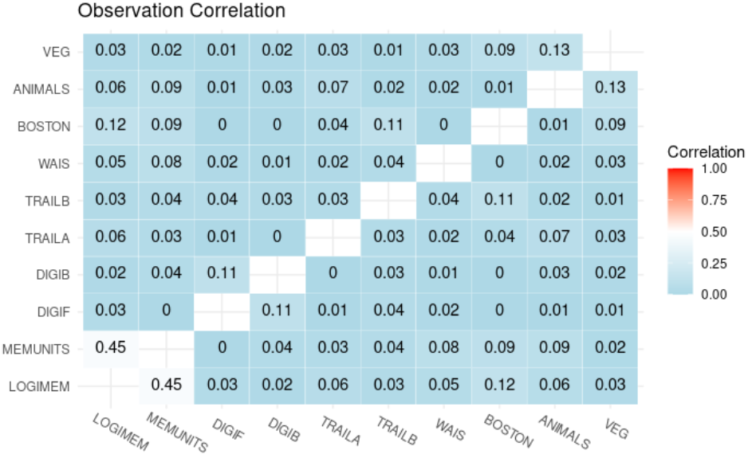
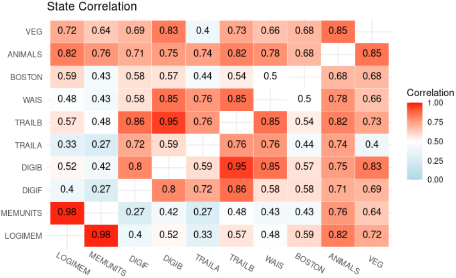

```{r, eval = TRUE, include = FALSE}
library(tidyverse)
library(knitr)
library(kableExtra)
knitr::opts_chunk$set(echo = FALSE)
ds <- "Paper2/JPrezTab/NACC_stateCor.RDS" %>%
  readRDS()
```


```{r}
dseig <- eigen(ds)

facLoading <- t(t(dseig$vectors) * sqrt(dseig$values))
rownames(facLoading) <- row.names(ds)
colnames(facLoading) <- paste("PC_", 1:10, sep = "")

facLoading <- facLoading %>%
  data.frame() 
prop <- dseig$values / sum(dseig$values)


```

## Correlation Matrices from Real Analysis







## Computing Principal Components from State Correlation Matrix to Infer Factor Design

First, I take the eigenvalue decomposition from the correlation matrix. 

### How many factors should I choose?

To decide the number of factors, I take into account how many of the principle components it takes to reach 95% of the variance of the outcomes, which happens at about 4 factors.

```{r}

data.frame(
  pc = paste("PC_", 1:10, sep = ""),
  prop = round(prop, 3),
  cumprop = round(cumsum(prop), 3)
) %>%
  kbl() %>%
  kable_paper("hover", full_width = F)
```


### Factor Loadings

To get the factor loadings I use eigen vectors * sqrt(eigen values).

```{r}
facLoading %>%
  round(3) %>%
  select(PC_1:PC_4) %>%
  kbl() %>%
  kable_paper("hover", full_width = F)
```

I then do abs(loading)/sum(loading) for each column to see the relative loading of each test. This gets at which tests are most highly loaded onto the factor.

```{r}
facLoading %>%
  mutate_all(.funs = list(function(x)abs(x)/sum(abs(x)))) %>%
  round(3)%>%
  select(PC_1:PC_4) %>%
  kbl() %>%
  kable_paper("hover", full_width = F)
```


## Choosing form of G

To get the form of G, I look at the proportion of loading above some threshold. If it is above that threshold, we will call it a part of the given factor. A seemingly natural cut-off would be a loading of greater than 1/#outcomes = 1/10. This leads to the following form:


```{r}
facMat <- facLoading %>%
  mutate_all(.funs = list(function(x)abs(x)/sum(abs(x)))) %>%
  mutate_all(.funs = list(function(x)ifelse(x < 0.1, 0, 1))) %>%
  select(PC_1:PC_4) %>%
  as.matrix()

rbind(facMat, TOTAL = colSums(facMat)) %>%
  cbind(., TOTAL = rowSums(.))%>%
  kbl() %>%
  kable_paper("hover", full_width = F)

```

Every factor has 4 or 5 tests loaded onto it and each test loads on to 1-3 factors. This seems to be identifiable enough for our purposes.

## Next step

Compare this form of G to the form of G that each test is supposed to load as you showed me in that paper. 
