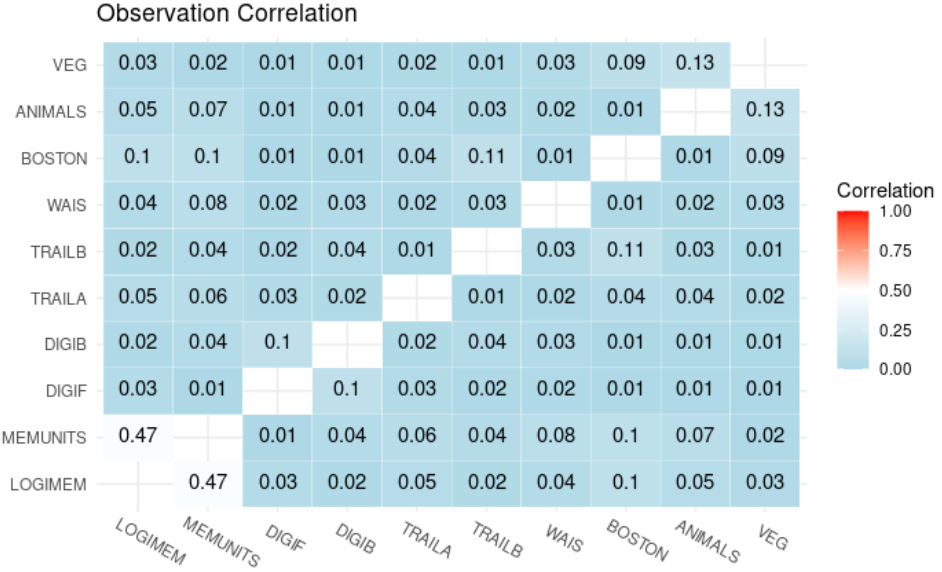

## Real Data Simulation

To test the validity of the MLLT model on real cognition data, a real data simulation is conducted. For this simulation, participants are randomized to  one of two groups. One of the randomized groups having no change to their outcomes and the other group receiving an added constant linear effect to each of the NACC outcomes. Although we do not know the true data generation process or the inter-relation between each test, we do know the true simulated "group" effect. The primary aim of the MLLT as presented is not specifically for modelling linear effects, but by estimating linear effects we are able to assess overall model validity. To declare model adequacy we desire a model that has low bias, low parameter variance (assessed by small confidence intervals), and proper 95% parameter coverage. 

Using a similar simulation strategy, the LLT was established to model the NACC battery data well [] and, for this reason, the LLT was used as a baseline comparison. The LLT is fit to each outcome while controlling for the covariates of interest [] as well as the simulated group effect. Three separate MLLT models are fit to the data that each carry different modeling assumptions: 1.) correlation only exists in the observation equation (O), 2.) correlation only exists in the state equation (S), and 3.) correlation exists in both the observation and state equation (OS). For each of the models, 5000 iterations of the Gibb's sampler is carried out with a burn-in of 2000. The process of randomizing each participant to a group with, one having an added linear effect, and estimating the group effect with each model is repeated 1,000 times. The group effect was chosen to be 1 for each outcome.

### Real Data Simulation Results

When estimating the randomized group effects the LLT, O, S, and OS models all maintain unbiasedness. The LLT, S, and OS are all able to maintain near 95% coverage of the true linear effect. However, the O model tends to undercover the true parameter as seen in table [] (average coverage of 0.90), indicating that this model does not fit the model as well. The confidence interval for the O model is tightest, which would indicate higher power, but because the O model doesn't maintain 95% coverage the result is inconsequential. The S and OS models maintain the desired confidence interval lengths when compared to the baseline independent models.

Reasoning for the ill-fitting model O can be observed in the estimated observation and state correlation matrices in the OS model [figure_, figure_]. When estimating both correlation matrices, very little correlation is placed in the observation equation, except for moderate correlation between MEMUNITS and LOGIMEM (cor = 0.47). The next highest correlation is between the ANIMALS and VEG naming (cor = 0.13). However, there is very high correlation placed in the state equation matrix with the lowest correlation being between TRAILA and MEMUNITS (cor = 0.30) and the highest correlation between MEMUNITS and LOGIMEM (cor = 0.97). These findings emphasize the importance of the underlying cognitive state process and the inter-relation of this processes between cognitive tests. Then the underlying state correlation goes unaccounted for, it leads to too much correlation going into the observation equation in the O model and faulty estimates.

If the primary concern of analysis is to estimate the underlying state process correlation, both the S and OS models can be seen as valid. For the NACC data, if power is of concern, one may decide to use the S model as there are 45 fewer covariance parameters to estimate and there is generally very low correlation in the observation equation. In our analysis, eliminating the covariance in the observation does not seem to increase power a significant amount and by eliminating the observation covariance could add bias to the state covariance estimate. 

